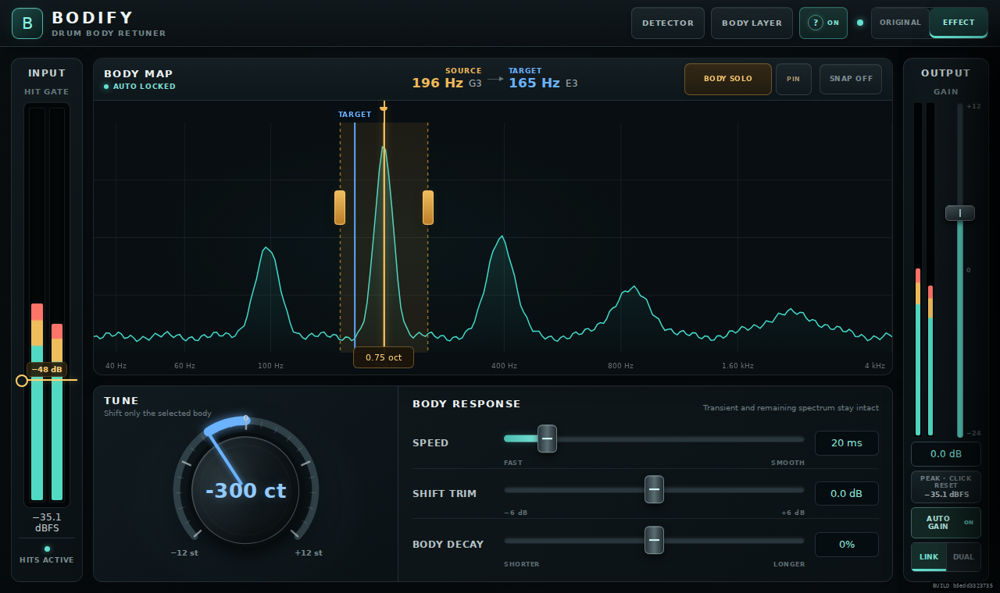

# BODIFY

BODIFY is a studio-first drum body retuner and optional source-following resynthesis
effect for Amorph. The implementation follows the versioned product and DSP plan in
`docs/PRODUCT_CONCEPT.md`. The interface is built as a
responsive Resonance Workbench: the Body Map dominates the surface, Tune is the
single rotary hero control, and Speed, Shift Trim, and Body Decay are large linear
work controls. Detector correction and future Body Layer/Replace processing live in
optional drawers and do not occupy the normal working surface.

Version 0.2.1 is the current M1 maintenance checkpoint. The 0.2.0 audio core
implements the zero-latency modal retuner and real DSP telemetry; it does not claim
the later phase-coherent Studio engine or the planned Body/Noise/Exciter layers.

## Files

- `Bodify.cmajorpatch` — Amorph/Cmajor patch manifest
- `BodifyDSP.cmajor` — Cmajor processor and stable parameter contract
- `BodifyUI.js` — self-contained Amorph Web Component
- `preview.html` — generated, self-contained browser preview with a mock patch connection
- `tools/build_preview.mjs` — rebuilds the standalone preview from `BodifyUI.js`
- `tools/render_preview.mjs` — renders and smoke-tests the real interactive UI
- `tools/check_contract.mjs` — verifies the frozen parameter and telemetry contract
- `tests/BodifyCore.cmajtest` — Cmajor math and stability tests
- `tests/BodifyAudio.cmajtest` — deterministic audio Golden File regression tests
- `docs/UX_SPEC.md` — current workflow and interaction specification
- `docs/PRODUCT_CONCEPT.md` — product scope, DSP architecture, milestones, and tests
- `docs/CHANGELOG.md` — versioned implementation history

## DSP status — 0.2.0

Implemented and connected end-to-end:

- Threshold gate with hysteresis that never mutes the dry signal
- Focus/Width body extraction with primary and secondary modes
- Tune from -1200 to +1200 cents, Speed, Shift Trim, and Body Decay
- chromatic Snap, Body Solo/PIN, Auto Gain, Output, and smoothed Original/Effect
- linked stereo amplitudes/residuals with one shared detector
- real input/output meters, gate, detected frequency, confidence, and analysis state
- explicit `LISTENING`, `NO LOCK`, and `BODY LOCKED` UI states

Deliberately unavailable outside Preview mode until M2/M3:

- Dual-channel analysis, multi-peak proposals, contour editing, and live spectrum
- Body/Noise/Exciter generation and Layer/Replace routing

M1 is causal and adds no look-ahead buffer latency. It is not phase coherent. The
separate fixed-latency Studio engine remains an M4 target.

## Preview

Rebuild and render the standalone preview after changing the UI:

```sh
npm run preview:render
```

Then open `preview.html` directly or serve the repository directory with any local
HTTP server. For example:

```sh
python3 -m http.server 8080
```

The standalone preview explicitly enables simulated spectrum and meter data to
support UI evaluation in an ordinary browser without an audio engine. The Amorph
view itself listens only to real DSP output endpoints and does not animate invented
meters or analysis states.

Implemented interactions include one permanent Tune knob, direct Focus/Width editing
in the Body Map, three full-width Body Response sliders, direct numeric entry, a
vertical Output fader beside its meter, explicit Original / Effect comparison,
momentary/pinned Body Solo, chromatic Snap, and a permanent Threshold line inside the
Input meter. Body, Noise, and Exciter remain reserved as future channel strips; until
their audio engine exists they are visibly unavailable outside Preview mode. Their
secondary parameters open in a contextual inspector. All 33 Cmajor parameters have
exactly one rendered UI endpoint. Every endpoint also has a unified tooltip with its
purpose, range or choices, default value, and editing gesture. The same help opens on
pointer hover and keyboard focus and remains within the plug-in bounds. Every action
button uses the same contextual help system, including panels, Refine, peak reset,
channel inspectors, close actions, and the help switch itself. A compact
`?` header control hides or restores all visual help bubbles without
removing the keyboard-linked screen-reader descriptions; its preference is stored
locally when the plug-in host supports Web Storage.

The view uses native responsive layouts at supported host sizes instead of shrinking
a fixed chassis. The 1280×760 host is the full layout; 900 px and 766 px use compact
rules that preserve physical text, fader, and hit-target sizes. If an embedding window
is smaller than 766×455, the complete compact surface is proportionally fitted and
centered so controls are never clipped.

## Verification

With the official `cmaj` executable on `PATH`, the complete local verification is:

```sh
npm run test:contract
npm run test:fixtures
cmaj test tests
npm run test:audio
npm run preview:matrix
```

The audio suite checks a neutral-path residual tolerance and verifies that a
+1200-cent event moves the dominant 196 Hz fixture body toward 392 Hz. Generated
input/event fixtures and Golden Files are committed together with the DSP revision.

## Current UI states



Additional captures for the optional synthesis routings are available in
`docs/renders/bodify-layer-current.png` and
`docs/renders/bodify-replace-current.png`. The Detector drawer is captured in
`docs/renders/bodify-detector-current.png`; 900 px and embedded-width scaling checks are
available in `docs/renders/bodify-retune-compact.png` and
`docs/renders/bodify-retune-embedded.png`.
